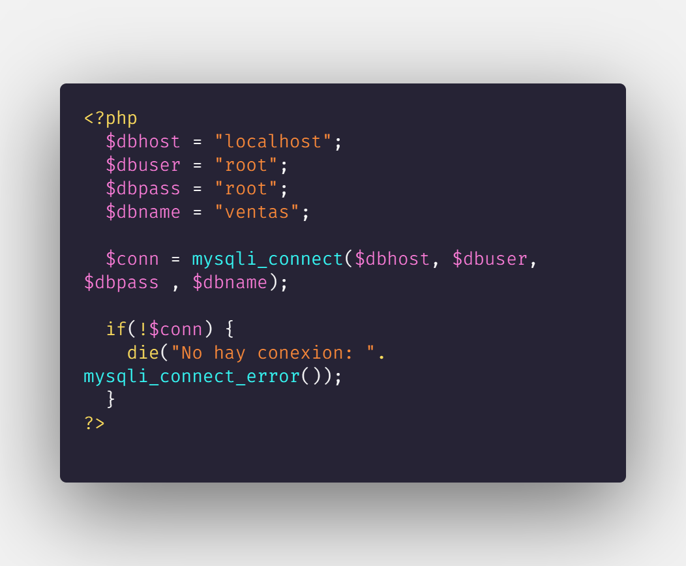
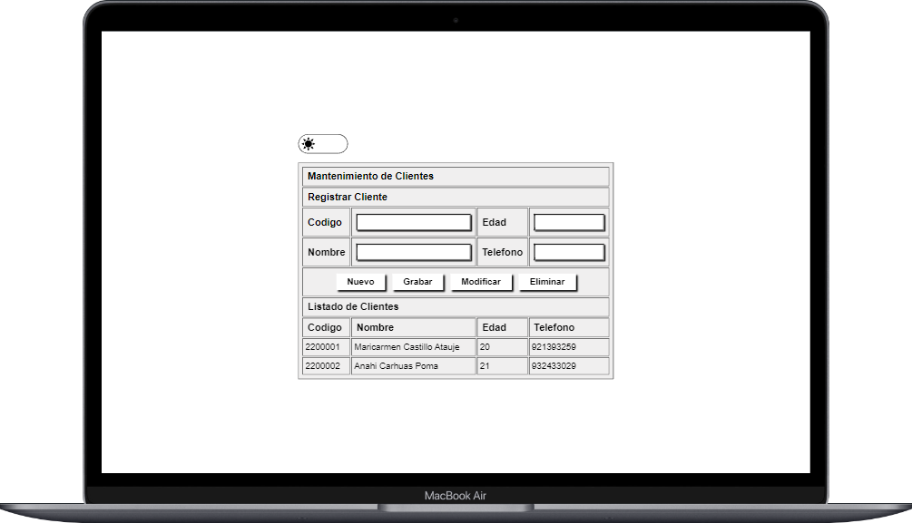
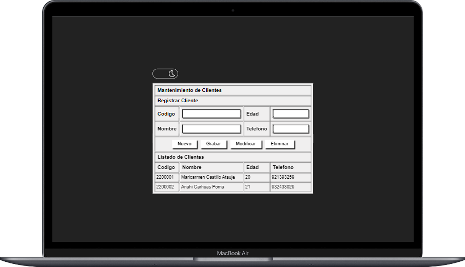

# CRUD añadir cliente 

Sistema en PHP y MYSQL que Lista, Agrega, Actualiza y Elimina un cliente.

## Nota

Modificar solo el archivo conexion

**Modificar** 

$dbhost = El nombre del host local o servidor

$dbuser = Nombre del usuario

$dbpass = Password del usuario

$dbname = Nombre de la base de datos

## Imagenes de referencia del programa

## Licencia

Copyright 2022 Renato Navarro Alberco